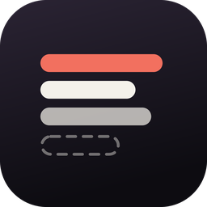
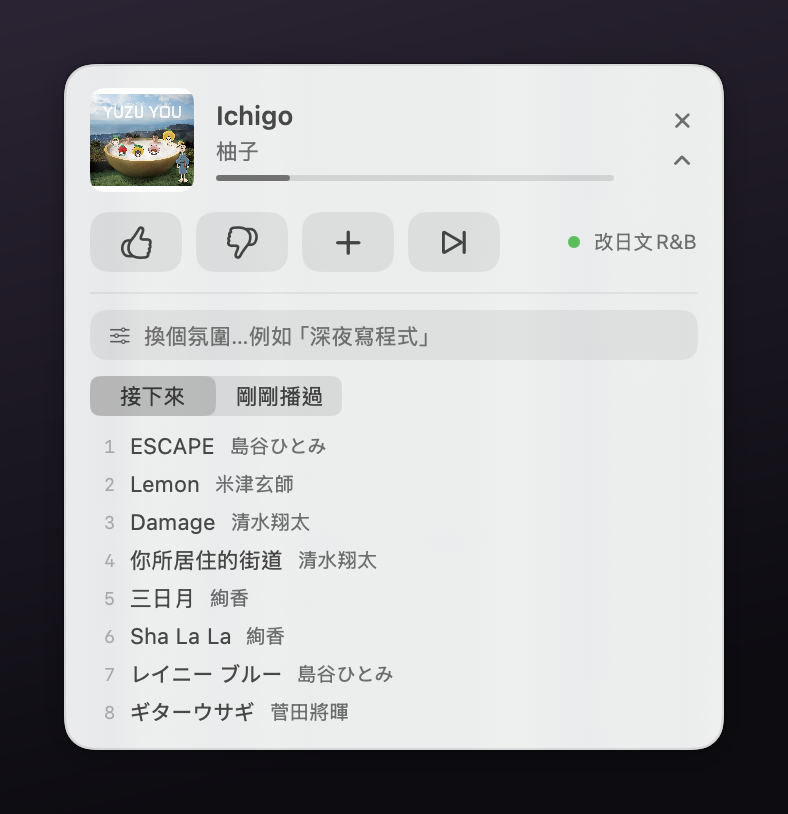

# Apple Music DJ



一支常駐在螢幕角落的小 app，依你打的一句「氛圍」持續幫 Apple Music 排歌。
說一句「深夜寫程式，安靜不要有人聲」，它就自己維持一份 12 首的佇列，播到剩不到 8 首自動補，
你按 👍👎 它會學。開著「探索新曲目」的話，它還會定期去 Apple Music 目錄挖一首你資料庫裡
沒有的歌，加進資料庫再排進佇列。

> A tiny macOS menu-less app that DJs your Apple Music library from a plain-language vibe.
> Rule-based selection, no API keys, no LLM calls, no network.

<p align="center">
  
</p>

靈感來自 [Nick Baumann 用 Codex DJ Spotify 的做法](https://x.com/nickbaumann_/status/2090551906657517876)。
差別在於 Spotify 有佇列 API 可用，Apple Music 沒有——所以這裡走的是 AppleScript 原生路線，
佇列的實體就是 Music.app 裡一個叫「🎧 DJ」的播放清單。

## 安裝

到 [Releases](../../releases) 下載 `AppleMusicDJ-*.dmg`，把 app 拖進 Applications。

第一次開啟會被 macOS 擋（「無法驗證開發者」）——這支 app 沒有經過 Apple 公證。
在 Applications 裡對它**按右鍵 →「打開」→ 再按一次「打開」**，只需做這一次。

啟動後會問「Apple Music DJ 想要控制『音樂』」，必須允許。

要用〈探索新曲目〉的話還要多給一個權限：**系統設定 → 隱私權與安全性 → 輔助使用 →
打開「Apple Music DJ」**。第一次探索會自動跳出這個請求；沒給的話探索會自己關掉，
並在小窗與 `dj now` 顯示原因，不會靜靜失敗。

### 需求

- macOS 13 以上、Apple Silicon
- Apple Music 訂閱，且**「同步資料庫」要開啟**（音樂 App → 設定 → 一般 → 同步資料庫）
- 排歌本身只用你**已加入資料庫**的歌；要它去目錄挖新歌，見下面的〈探索新曲目〉
  （那個功能需要另外給「輔助使用」權限）

## 用法

展開小窗（右上 `⌄`），在輸入框打一句氛圍就好：

```
深夜寫程式，安靜不要有人聲
早晨咖啡
夏天海邊
放鬆但不要古典
想聽聖誕鋼琴
```

六顆按鈕，左邊三顆是走帶控制、右邊三顆是回饋：

**▶︎/⏸** 播放／暫停 —— 沒在播的時候按下去就是**從 app 啟動 DJ**（不必重打氛圍）／
**⏹** 停止播放並關掉 DJ（必須同時關 DJ，否則下一次心跳會自己把音樂接回去）／
**⏭** 跳過｜**👍** 之後多排這種／**👎** 封鎖這首並少排這類（同時跳過）／
**＋** 存進「🎧 DJ 精選」。

展開區有「接下來／剛剛播過」兩個分頁，以及探索的開關。佇列裡開頭是 ✨ 的，
就是探索挖回來的新歌。

### 命令列（選用）

`cli/dj` 是同一套狀態的遙控器，適合從終端機或腳本控制：

```bash
ln -s "$PWD/cli/dj" ~/.local/bin/dj

dj on "深夜寫程式"     # 設氛圍並開啟小窗
dj vibe "早晨咖啡"     # 換氛圍
dj now                 # 現在播什麼＋接下來 10 首
dj history             # 剛剛播過的歌
dj up / down / keep / skip
dj play / stop         # ▶︎/⏸ 切換播放、⏹ 停止並關 DJ
dj explore             # ✨ 立刻探索一首新歌
dj explore on|off      # 自動探索開關
dj explore wide on|off # 探索是否也撈曲風排行榜
```

## 選曲怎麼決定

純規則、不呼叫模型、不連網。每首歌的分數來自六層：

1. **氛圍詞典** — 16 組關鍵字（專注／深夜／早晨／放鬆／振奮／失戀／懷舊／古典／
   爵士／雷鬼／抒情…）對應曲風加減分，中英皆可。
2. **你自己的播放清單名稱** — vibe 與清單名有共同詞就大幅加權。
   這是實測最強的訊號：「失戀時聽的周杰倫」這種清單名本身就是最好的語意標籤，
   比任何曲風分類都準。
3. **否定詞** — 「不要有人聲」「放鬆但不要古典」會反向計分（認得
   `不要／不想／別放／避開／no／without`）。
4. **速度標記** — 古典曲名本身就寫著這首吵不吵。`Allegro／Presto／Marsch／
   Polka schnell／Scherzo` 重罰，`Adagio／Andante／Largo／Sarabande／Nocturne／
   Prélude` 加分；vibe 屬於「要安靜」那類時自動啟用，要熱血時反向。
   這是規則式選曲唯一能看出「同一曲風裡性格差很多」的切入點。
5. **回饋學習** — 👍 加權該藝人＋專輯＋曲風，👎 封鎖該曲並降權該藝人。權重上下限 ±6。
6. **重複與時節** — 近 6 小時播過的指數衰減降權、同一批同藝人最多 2 首、
   同名同藝人去重；聖誕／賀歲曲平常重罰，除非 vibe 明講。

最後是**加權隨機抽樣**（分數平方為權重，只從前段候選抽），所以同一個 vibe
不會每次都給一模一樣的歌單。

## 探索新曲目

預設開著。DJ 在播、佇列要補歌、距上次探索超過 7 分鐘時，它會去挖一首**你資料庫裡沒有**
的歌，加進資料庫，再排進佇列（佇列裡標成 ✨）。展開小窗可以關掉，或按 ✨ 立刻跑一次。

候選來自兩條線：

- **同藝人延伸**（預設）— 由當下 vibe 高分的藝人出發，用 iTunes Search API 的
  `artistTerm` 找他們你還沒收的曲目。命中率最高、風格最穩。
- **曲風排行榜**（「含排行榜」勾起來才開）— 用 vibe 命中的曲風去撈 Apple 的排行榜
  RSS。這條才會冒出**沒聽過的藝人**，代價是命中率低一截。

候選一律再走一次 `TrackPicker` 的評分（曲風權重、否定詞、速度標記、節慶曲、回饋權重），
分數 ≤ 0 的不要 —— 探索不該把不合 vibe 的東西塞進你的資料庫。同一位藝人最多兩首，
分數再加一點隨機擾動，否則 `artistTerm` 會讓同一個人整批洗版。

不需要 API key，也不需要 Apple Developer 帳號。

### 為什麼要「加進資料庫」這一步

Apple Music 的目錄歌用 URL Scheme（`music://music.apple.com/…`）確實可以直接播，
但那首歌對 AppleScript 而言是個幽靈：`class` 是 `URL track`、`cloud status` 是
`missing value`、`container` 是 `Scripting`。它排不進播放清單，`duplicate` 會被
`Can only duplicate subscription tracks to library source` 擋掉，👍👎 也綁不住 ID。

只有真的加進資料庫，才拿得到可排隊的 track。而 Music.app 的 AppleScript 字典沒有
「加入資料庫」這個動作，所以只能走無障礙 API 去點 UI。流程是：

```
iTunes Search API 找候選（免 key）
  → open music://…            導覽到那首歌（不會中斷正在播的歌）
  → 無障礙 API 捲動掃描找到那一列
  → 點該列的「更多」→ 鍵盤選第一項「加入資料庫」
  → 輪詢 findTrack() 等 iCloud 同步出真的 database ID
  → 走既有的 append() 排進「🎧 DJ」清單
```

### 這條路的限制

- **需要「輔助使用」權限**，而且它跟「自動化」是分開的兩格：送 Apple Event 給
  System Events 算自動化，讀別的 app 的 UI 元素才算輔助使用。第一次探索會跳系統授權；
  沒給就自動關掉探索不再空轉，並把原因寫進小窗與 `dj now`。
- **自己重新 build 之後要重新授權**：ad-hoc 簽章的 cdhash 每次都不一樣，
  輔助使用的授權跟著失效。裝 DMG 的一般使用者只會遇到一次。
  麻煩的是**在系統設定裡「把勾關掉再打開」修不好** —— TCC 那筆記錄的 code requirement
  綁死當初的 cdhash，切換開關只改批准狀態、不會重新綁定，於是清單看起來是開的、
  `AXIsProcessTrusted` 卻永遠回 false。要整筆刪掉讓它重建：

  ```bash
  tccutil reset Accessibility net.housearch.applemusicdj   # 不需要 sudo
  ```

  然後**重新開啟 app**（授權在程序啟動時就定案，不重開讀到的還是舊快取）。
  開發時也記得同一時間只留一份 app 在跑：`build/` 與 `~/Applications/` 兩份的
  cdhash 不一樣，授權不共用。
- **會真的把歌加進你的資料庫**，「最近加入」會留下痕跡。不想要就把探索關掉。
- **綁在中文（或英文）按鈕描述上**：找的是描述為「更多」／`More` 的按鈕。
  系統語言換成別的就會失效（會回報「點不到『更多』選單」，不會亂點）。
- **那顆選單 Music.app 沒有暴露給無障礙 API**（`menu 1 of button` 取不到、
  process 層也查不到 `menus`），只能用鍵盤選第一項。所以候選一定要先確認
  **不在資料庫裡** —— 在的話第一項會變成「從資料庫中移除」。程式在送鍵之前就
  用曲名＋藝人濾掉庫內曲，事後也會驗證資料庫真的長出這首歌，沒長出來就當失敗。
- **單次探索約 20～25 秒**，所以跑在獨立佇列上，不擋 15 秒心跳。
- 探索期間會短暫把 Music.app 帶到前景（鍵盤事件需要），做完立刻把焦點還給原本那個 app。

## 架構

```
Apple Music DJ.app
├─ Engine        15 秒心跳：補佇列、吃回饋、記錄播放歷史
├─ TrackPicker   選曲評分（上面那六層）
├─ Explorer      探索新曲目（iTunes Search API ＋ 無障礙 API 點「加入資料庫」）
├─ MusicBridge   AppleScript 橋接（osascript 子行程）
└─ PanelView     SwiftUI 浮動小窗
        │
        └─→ ~/Library/Application Support/apple-music-dj/state/
              state.json · history.jsonl · feedback.jsonl · nowplaying.json
                        ↑ CLI 從這裡讀寫，所以 app 與 dj 指令共用同一份狀態
```

佇列的實體是 Music.app 裡的「🎧 DJ」播放清單。引擎**只往末端追加**，不動已播過的部分，
所以接歌是 Apple Music 原生的無縫播放，而不是逐首點播。
換 vibe 時也只清掉「正在播那首之後」的部分，當前這首會播完。

## 開發

```bash
scripts/build.sh          # 建置 build/Apple Music DJ.app
scripts/make-dmg.sh       # 建置並打包 build/AppleMusicDJ-<版本>.dmg
scripts/make-icon.py      # 重新產生圖示（需要 Pillow）
```

只需要系統內建的 `swiftc`，不需要 Xcode 專案檔。

## 踩過的坑

做這個東西時撞到幾個不會自己浮出來的問題，記在這裡：

- **borderless `NSPanel` 預設 `canBecomeKey = false`**，SwiftUI 的按鈕會完全收不到點擊，
  而且毫無錯誤訊息。必須子類化覆寫 `canBecomeKey`，再配一個覆寫 `acceptsFirstMouse`
  的 `NSHostingView` 讓第一下點擊就生效。
- **`NSPanel` 的 contentRect 是寫死的**，SwiftUI 內容長高時視窗不會跟著長，展開的清單
  會被無聲裁掉。解法是在 hosting view 的 `layout()` 裡按 `fittingSize` 重設視窗，
  並同步調整 `origin.y`（Cocoa 原點在左下），左上角才會待在原地。
- **設 `.accessory` 活動策略的 app，System Events 完全看不到**，AX 座標查不到，
  自動化測試只能靠截圖。
- **`swiftc -parse-as-library` 不准 top-level 程式碼**，要用 `@main struct`；
  且 `NSApplication.delegate` 是 weak，delegate 必須有人持有否則被回收。
- **`Picker` 會跟 SwiftUI 的 `Picker` 撞名**，錯誤訊息卻指向不相干的
  `.pickerStyle(.segmented)`。
- **浮動面板裡的文字輸入是三個問題疊在一起**，症狀是「點輸入框，整個 app 就消失」：
  1. `NSPanel` 的 `.utilityWindow` 預設 `hidesOnDeactivate = true`，app 一失去作用中
     狀態面板就自己隱藏；再配上 `applicationShouldTerminateAfterLastWindowClosed`
     回傳 `true`，等於**焦點一離開就自動退出**。而且離開碼是 0，不會留下當機報告，
     看起來就像憑空消失。
  2. `.nonactivatingPanel` 讓點擊不會使 app 變成作用中，鍵盤事件根本不會送到輸入框。
  3. `.accessory` 策略的 app 不作用中就沒有 text input context，中文輸入法接不上，
     console 會噴 `error messaging the mach port for IMKCFRunLoopWakeUpReliable`。

  解法是三個一起改：`hidesOnDeactivate = false`、終止判斷改回 `false`、拿掉
  `.nonactivatingPanel`，然後在輸入框取得焦點時 `NSApp.activate`、失焦與按完回饋鈕時
  `NSApp.deactivate` 把焦點還給原本在用的 app。
- **launchd 背景程序不能住 `~/Documents`**（見 `legacy/python-daemon/`）。
- **AppleScript 的 `item 2 of (position of e)` 會丟錯**，而錯誤被外層 `try` 吃掉之後
  症狀是「明明找得到那個元素，取座標卻永遠失敗」。`position` 必須先落成變數再取 item。
  同一類地雷還有保留字：`by`、`removed` 當變數名都會編譯失敗，訊息完全不知所云。
- **Music.app 的曲目清單是虛擬化的**，只有畫面內的列會出現在無障礙樹裡，
  深連結也不保證捲到目標那一列。要靠 `set value of scroll bar 1 of <scroll area>`
  逐段掃描。順帶一提，把列舉範圍從整個視窗縮到內容區（跳過側邊欄），
  單次探索從 95 秒降到 21 秒 —— `entire contents` 是這段唯一的效能瓶頸。
- **古典樂誌面只印樂章名**：頁面上是「II. Adagio」，iTunes API 給的卻是
  「Violin Concerto in E Major, BWV 1042: II. Adagio」。比對要放寬到樂章名，
  再用同一列的時長字串把同名樂章區分開。

## 授權

MIT
